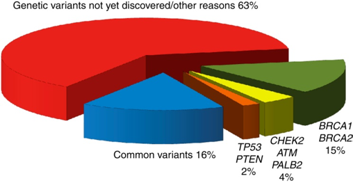

# Familial breast cancer

In the mid-19th century a French medical doctor, Pierre Paul Broca, reported for the first time a case of familial breast cancer. Indeed, his wife acquired breast cancer, as many women in her family had for, at least, 4 generations. Cases of familiar breast cancer usually occur in women younger than 50 years, and bilateral primary breast tumors are frequent. Epidemiological studies later quantified the relative risk conferred by a the presence of multiple breast cancers in the family at 2.7. Moreover, they exhibit a higher likelihood of acquiring triple-negative breast cancer.

# Genes involved in familial breast cancer

It wasn’t until the late 20th century that two genes involved in DNA repair, BRCA1 and BRCA2, were associated with hereditary breast and ovarian cancer (HBOC). Some mutations in these genes increase the risk of developing breast cancer, giving respectively a 57–65% or 45–55% risk of developing breast cancer by age 70 among women. For that reason, BRCA1 and BRCA2 mutations are rare in most populations (1 of 400).

HBOC follows an autosomal dominant inheritance pattern. While approximately 5–10% of all patients with breast cancer exhibit a monogenic predisposition to breast and ovarian cancer, only about 25% of them harbor BRCA1/2 mutations. Other 23 genes have been associated with familial breast and/or ovarian cancer (Table 1).

Table 1. Overview of HBOC genes: estimated lifetime risk of breast cancer (age in years) and tumorogenic molecular mechanisms that involves them: homologous recombination repair (HRR), replication fork stability, transcription–replication collisions, mismatch repair (MMR), DNA damage signaling, checkpoints and cell death, and/or others. Adapted from *Nielsen et al.*

**Gene**|**Breast cancer estimated lifetime risk (age in years)**|**HRR**|**Replication fork stability**|**Transcription–replication collisions**|**MMR**|**DNA damage signaling, checkpoints and cell death**|**Other**
:-----:|:-----:|:-----:|:-----:|:-----:|:-----:|:-----:|:-----:
ATM|60% by age 80|✓| | | |✓|
BARD1|Unknown|✓| | | | |
BLM|Unknown| |✓| | | |
BRCA1|57–65% by age 70|✓|✓|✓| |✓|
BRCA2|45–55% by age 70|✓|✓|✓| |✓|
BRIP1|OR: <2.0| | | | | |
CDH1|42% by age 80| | | | | |✓
CHEK2|37% by age 70| | | | |✓|
FAM175A|Unknown|✓| | | | |
FANCC|Unknown| |✓| | | |
FANCM|Unknown| |✓| | | |
MLH1|~19% by age 70| |✓| |✓| |
MRE11|Unknown| | | |✓| |
MSH2|~11% by age 70| | | |✓| |
NBN|OR: 3.0|✓| | | | |
NF1|6.5-fold increase in women aged 30–39| | | | | |✓
PALB2|35% by age 70|✓|✓| | | |
PMS2|SIR: 3.8| | | |✓| |
PTEN|85% by age 70| | | | | |✓
RAD51B|Unknown|✓| | | | |
RAD51C|Unknown|✓| | | | |
RAD51D|Unknown|✓| | | | |
RECQL|Unknown| |✓| | | |
RINT1|Unknown|✓| | | | |
STK11|32% by age 60| | | | | |✓
TP53|25% by age 70| | | | |✓|

## Molecular function

Nearly all known HBOC susceptibility genes encode tumor suppressors that participate in genome stability pathways (homologous recombination repair, replication fork stability, transcription–replication collisions, mismatch repair, and DNA damage signaling, checkpoints and cell death).

### Homologous recombination repair

The homologous recombination repair pathway (HRR) deals with double strand DNA breaks by using the undamaged chromosome as template for error-free repair. After a DSB occurs, the MRN complex (MRE11, RAD50 and NDN) detects and binds the free DNA ends. Then, it promotes DNA damage checkpoint signaling.

HRR involves BRCA1, BRCA2 and, actually, most of the HBOC genes. Because of its ability to interact with a wide range of proteins, BRCA1 is hypothetized to act as a recruitment scaffold. A deficiency of BRCA1 is linked to the inability to trigger HRR. Mutations in the MRN complex have also been clinically associated to breast cancer, although dubiously so in the case of RAD50 variants. Reassuringly, some other HBOC genes are interactors of the MRN complex and BRCA1/2.

### Replication fork stability

BRCA1 and BRCA2 protect newly synthesized DNA and promote the restart of stalled forks in an HRR-independent manner. In the absence of these proteins, newly synthesized DNA in a stalled fork would get degraded, leading to genome instability and increasing the risk of cancer.

### Transcription–replication collisions

Collisions between transcription and replication are emerging as a source of genome instability. In particular, RNA-DNA hybrids called R-loops can form between the nascent transcript and the DNA template. They can lead to double-strand breaks and mutations. Both BRCA1 and BRCA2 participate in the resolution of R-loops, preventing their accumulation. In consequence, BRCA-deficient cells tend to suffer transcriptional stress that leads to genome instability. Nonetheless the relationship between this mechanism and proneness to HBOC is yet to be proven, and the genes involved further investigated.

### Mismatch repair

DNA mismatch repair (MMR) corrects base-base mispairs. When MMR is faulty, accumulations point mutations and genetic changes in repeated nucleotide sequences (microsatellite instability) occur. MMR also plays a role in error-free HRR.

### DNA damage signaling, checkpoints and cell death

Pathways involved in genome maintenance, cell cycle checkpoints and cell death usually eliminate cells with damaged DNA. When proteins involved in them are not active, some processes such as cell cycle arrest, apoptosis and senescence will not occur. In consequence, cells that undergo genomic alterations are allowed to proliferate. The most famous case of HBOC in this pathway is TP53, which coordinates the transcriptional induction of many genome stability factors.

# Missing heritability

Despite the identification of HBOC genes, 52% of the heritability or familial breast cancer remains unexplained: 20% is explained by high penetrance loci and an extra 28% by common variants. We can illustrate this point with the largest genetic association in familial breast cancer so far, carried out in 2013 by Michailidou *et al.*. The study had two steps. In a first stage, 10,052 breast cancer cases and 12,575 controls of European ancestry were genotyped using the iCOGS platform. Through a GWAS, they selected 29,807 SNPs for further examination in a second stage on a larger cohort (45,290 cases and 41,880 controls). Despite estimating that at least 1,000 uncorrelated loci were involved in breast cancer susceptibility, they were only able to get a genome wide significance (p < 5 × 10−8) for ~5% of them (41 SNPs). Moreover, the 41 SNPs have low effect sizes (OR <= 1.26). In fact, only 10 of the +1000 candidate SNPs showed an OR > 1.05.

Proportion of heritability explained in familial breast cancer. From Rudolph *et al.*.

---
**iCOGS**

iCOGS is a custom Illumina array designed by four consortia that study genetic susceptibility of three hormone-related cancers: breast ([BCAC](http://ccge.medschl.cam.ac.uk/consortia/bcac/) and [CIMBA](http://ccge.medschl.cam.ac.uk/consortia/cimba/)), ovarian ([OCAC](http://ccge.medschl.cam.ac.uk/consortia/ocac/)) and prostate ([PRACTICAL](http://ccge.medschl.cam.ac.uk/consortia/practical/)). Its explicit purpose is to facile the genotyping in large case-control studies for these tumors. The criteria to include the SNPs was (i) previously associated with cancer susceptibility or survival; (ii) fine mapping of genomic regions of interest; (iii) associated with cancer-related quantitative traits; (iv) in selected candidate genes or pathways; (v) associated with other cancers. The final array included ~211,000 SNPs.

---

## GENESIS

GENESIS (GENE SISter) is a French project that aims to shed some light on familial breast cancer. The index cases are patients with a breast cancer affected sister and no BRCA1/2 mutations. The controls are unaffected colleagues and/or friends of the cases. This dataset is specially interesting for us: the heritability of the disease among the cases is not driven by BRCA1/2, but by rarer variants which are enriched in this experimental setting. GENESIS used the iCOGS genotyping platform.

# References

* Foulkes, W. D. (2008). Inherited Susceptibility to Common Cancers. The New England Journal of Medicine, 359(20), 2143–2153. https://doi.org/10.1056/NEJMra0802968
* Nielsen, F. C., van Overeem Hansen, T., & Sørensen, C. S. (2016). Hereditary breast and ovarian cancer: new genes in confined pathways. Nature Reviews Cancer, 16(9), 599–612. https://doi.org/10.1038/nrc.2016.
* Michailidou, K., Hall, P., Gonzalez-Neira, A., Ghoussaini, M., Dennis, J., Milne, R. L., … Easton, D. F. (2013). Large-scale genotyping identifies 41 new loci associated with breast cancer risk. Nature Genetics, 45(4), 353–361. https://doi.org/10.1038/ng.2563
* Rudolph, A., Chang-claude, J., & Schmidt, M. K. (2016). Gene – environment interaction and risk of breast cancer. British Journal of Cancer, 114(2), 125–133. https://doi.org/10.1038/bjc.2015.439
* Sakoda, L. C., Jorgenson, E., & Witte, J. S. (2013). Turning of COGS moves forward findings for hormonally mediated cancers. Nature Genetics, 45(4), 345–8. https://doi.org/10.1038/ng.2587
* Sinilnikova, O. M., Dondon, M.-G., Eon-Marchais, S., Damiola, F., Barjhoux, L., Marcou, M., … Andrieu, N. (2016). GENESIS: a French national resource to study the missing heritability of breast cancer. BMC Cancer, 16(1), 13. https://doi.org/10.1186/s12885-015-2028-9
