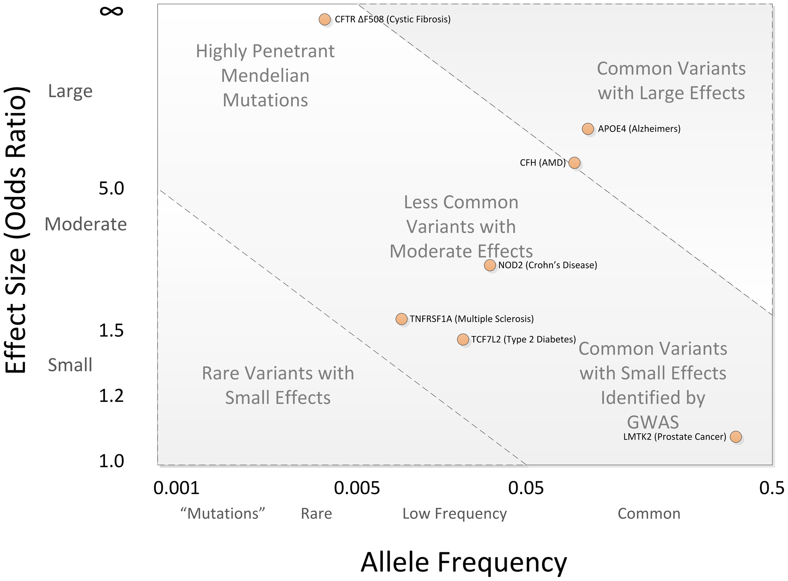

# GWAS

Genome-wide association studies (GWAS) aim to find genetic risk factors for complex phenotypes (Bush et al., 2012). This is achieved by systematically surveying a high number of genetic variants (from hundred thousands to a million) in many samples, often above the thousands. In the classical GWAS setting, a statistical test for association is conducted between each variant and the phenotype of interest. It is usually followed up by a statistical validation by genotyping of the "best hits" in independent samples.

Usually the phenotype of interest is a common, complex disease such as type II diabetes or schizophrenia. In this case, the ultimate goal is to be able to identify individuals at genetic risk, as well as understand the molecular basis of the disease. Due to its low cost and widespread availability, GWAS has been pushed beyond this realm. Many fields that profit from this ability to survey a sample genome are using GWAS, specially in personalized medicine (e.g. pharmacogenomics). In consequence, GWAS has become a paragon of translational bioinformatics.

allowed to quantify and identify the SNPs required to find associations between common variants and a trait in a hypothesis-free environment. Then 'SNP chips', microarrays that explored most of these variants, appeared, allowing to do so in a cheap way.

# Background

GWAS became possible thanks to the convergence of scientific effort and technological development.

## Human variation

The rationale of studying complex diseases through GWAS relies on the *common disease, common variant* (CD/CV) hypothesis: common diseases are partly attributable to allelic variants present in more than 1-5% of the population which cause, by itself or in combinations, small increments in risk (1.1 - 1.5-fold). Due to this limited effect size, only partial correlations between causal variants and phenotypes are expected. This notion is radically different from rare diseases associated to rare variants with big effect sizes, where every carrier of the risk allele develops the disease (complete correlation). In fact, this is consistent with population genetic theory (Manolio et al., 2009): variants that explain by themselves a big part of disease predisposition would reduce the reproductive fitness of the individual and, in consequence, would be unfrequent.

The modern unit of genetic variation are single-nucleotide polymorphisms (SNPs) (Bush et al., 2012). SNPs are single base-pair changes in the DNA sequence that occur with high frequency in the human genome. They are, by far, the most common form of genetic variation in humans. SNPs usually involve two alleles ie in a population there are two possible base-pairs for a genetic position. SNPs are characterized by the minor-allele frequency (MAF), that is, the frequency in the population of the least common allele.

SNPs can have functional consequences by themselves (e.g. change an amino acid in the protein). However, in the context of genetic studies, SNPs are used as markers of a chromosomic region. In consequence, the SNPs associated with a disease are not necessarily causal: they might just be close and in linkage disequilibrium with the causal variant.

### Linkage disequilibrium

Linkage disequilibrium refers to the fact that contiguous SNP

*** how human variation changes from population to population ***

### Capturing common variation

After the human genome was sequenced, international projects using sequencing technologies sprouted to characterize divergences from the reference genome. Possibly the best-known are HapMap and 1000 Genomes. The utility of these projects for genetic studies is two-fold: they allow to identify the genomic regions to survey and describe the population-specific differences.

# Challenges

Vischer conducted one of the biggest GWAS experiments to date, to inquire about the heritability of height (Visscher, 2008). Three studies with a total sample size of ∼63k individuals (14k + 16k + 34k) identified 54 variants that are reliably associated with height. However, there was an alarmingly low overlap between the causal SNPs identified in the different studies. They proposed two reasons for this. First, we are dealing with SNPs that have a very limited effect size (% of variation explained). In consequence, we need sample sizes of the order of tens of thousands to reliably identify one causal SNP. Second, we are conducting the hundreds of thousands of association tests. Thus, we need to be very stringent with the significant threshold in order to minimize type I errors (false positives).

Another consideration regarding GWAS is that most studies have been carried out on European ancestry populations, which has a reduced variability in comparison to other human populations. In fact, studies on non-European populations have yielded a big number of new, intriguing variants.

# References

* Bush, W. S., & Moore, J. H. (2012). Chapter 11: Genome-wide association studies. PLoS Computational Biology, 8(12), e1002822. https://doi.org/10.1371/journal.pcbi.1002822
* Manolio, T. A., Collins, F. S., Cox, N. J., Goldstein, D. B., Hindorff, L. A., Hunter, D. J., … Visscher, P. M. (2009). Finding the missing heritability of complex diseases. Nature, 461(7265), 747–753. https://doi.org/10.1038/nature08494
* Visscher, P. M. (2008). Sizing up human height variation. Nature Genetics, 40(5), 489–90. https://doi.org/10.1038/ng0508-489
